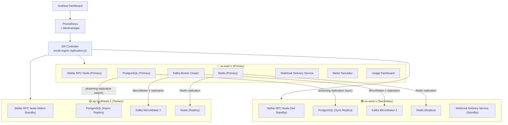

# Multi-Region Replication and Disaster Recovery Architecture

**Issue:** #121  
**Status:** Active  
**Last updated:** 2026-08-23  
**Classification:** Engineering — System-Wide

---

## Table of Contents

1. [Problem Statement and Goals](#1-problem-statement-and-goals)
2. [Architecture Overview](#2-architecture-overview)
3. [Region Topology](#3-region-topology)
4. [Replication Strategy](#4-replication-strategy)
5. [RPO / RTO Targets](#5-rpo--rto-targets)
6. [Failover Decision Matrix](#6-failover-decision-matrix)
7. [Network and Service Mesh](#7-network-and-service-mesh)
8. [Security Controls](#8-security-controls)
9. [Blue-Green and Canary Deployment](#9-blue-green-and-canary-deployment)
10. [Monitoring and Observability](#10-monitoring-and-observability)
11. [DR Test Scenarios](#11-dr-test-scenarios)
12. [Runbook References](#12-runbook-references)

---

## 1. Problem Statement and Goals

The Utility Protocol stack targets **99.99% availability** (52 minutes 36 seconds of permitted downtime per year) and a **< 100 ms P99 critical-path latency** budget. A single-region deployment cannot satisfy this SLO under the following realistic failure classes:

- Availability zone (AZ) outage inside a cloud region
- Full cloud-region unavailability
- Stellar Testnet / Mainnet RPC node degradation
- Kafka broker failure or data corruption
- PostgreSQL primary database failure
- Off-chain service process crash or deployment regression

The multi-region strategy ensures that any single-region fault triggers automatic or operator-assisted failover within the RTO target, replication lag remains within the RPO target during normal operation, and DR readiness is continuously validated through scheduled tests and chaos experiments.

### Goals

| Goal | Metric | Target |
|---|---|---|
| High availability | Successful request ratio | ≥ 99.99% per 30-day window |
| Low latency | Critical-path P99 | < 100 ms |
| Recovery point objective | Maximum data loss on failover | ≤ 60 seconds |
| Recovery time objective | Time to restore service after region failure | ≤ 5 minutes |
| DR test coverage | Scheduled DR validation frequency | ≥ once per 24 hours |

---

## 2. Architecture Overview



---

## 3. Region Topology

| Region | Role | Promotion Priority | Active Services |
|---|---|---|---|
| `us-east-1` | Primary | 1 (active) | All services |
| `eu-west-1` | Secondary | 2 (hot standby) | Webhook, DB replica, Kafka mirror |
| `ap-southeast-1` | Tertiary | 3 (warm standby) | DB replica, Kafka mirror |

### Region health states

| State | Description | Automatic action |
|---|---|---|
| `HEALTHY` | All probes pass, replication lag within RPO | None |
| `DEGRADED` | One probe failing or replication lag approaching RPO | Alert + increased monitoring frequency |
| `CRITICAL` | Multiple probes failing or RPO breached | Alert + auto-failover evaluation |
| `FAILOVER_IN_PROGRESS` | Active DR failover executing | Block new traffic, monitor recovery |

---

## 4. Replication Strategy

### 4.1 Stellar Contract State

Stellar contract state is immutable on-chain; the risk is loss of access to the Soroban RPC endpoint. Each region runs an independent Horizon / Stellar RPC node that stays synchronized with the Stellar network. Failover switches the RPC endpoint URL without any data migration.

```
Normal: Services → us-east-1 Stellar RPC
Failover: Services → eu-west-1 Stellar RPC (sub-second switch)
```

### 4.2 PostgreSQL (Off-Chain Indexer / Webhook DB)

| Parameter | Value |
|---|---|
| Replication mode (primary → secondary) | Synchronous streaming replication |
| Replication mode (primary → tertiary) | Asynchronous streaming replication |
| Max allowed sync replication lag | 60 seconds (RPO target) |
| WAL retention | 7 days |
| Failover method | Patroni + HAProxy |

Promotion to secondary:
1. Pause all writes to the primary.
2. Confirm secondary has consumed the WAL tail.
3. Promote secondary to primary via `pg_promote()`.
4. Update connection strings in Kubernetes secrets.
5. Redirect HAProxy upstream.

### 4.3 Kafka Topics

| Parameter | Value |
|---|---|
| Replication tool | Kafka MirrorMaker 2 |
| Replication lag target | < 30 seconds |
| Topics replicated | `utility.usage`, `utility.billing`, `utility.alerts`, `utility.meter-heartbeat` |
| Consumer offset replication | Enabled (`offsets.topic.replication.factor: 3`) |

Failover shifts consumer group endpoints to the mirror topic in the secondary region. Offsets are replicated so consumers resume without reprocessing.

### 4.4 Redis Cache

| Parameter | Value |
|---|---|
| Replication mode | Redis primary-replica |
| Max replication lag | 5 seconds |
| Persistence | RDB snapshots every 60 seconds + AOF |
| Failover method | Redis Sentinel (3 sentinels across AZs) |

Cache misses during failover are tolerated; the underlying PostgreSQL or Stellar RPC serves as the source of truth.

---

## 5. RPO / RTO Targets

| Service | RPO | RTO | Failover type |
|---|---|---|---|
| Stellar RPC endpoint | 0 s (stateless switch) | 30 s | Automatic |
| Webhook delivery service | 60 s | 3 min | Automatic |
| PostgreSQL indexer | 60 s | 5 min | Automatic (Patroni) |
| Kafka topics | 30 s | 2 min | Automatic (MirrorMaker) |
| Redis cache | 5 s | 1 min | Automatic (Sentinel) |
| Usage dashboard | 60 s | 5 min | Automatic |
| Full stack recovery | 60 s | 5 min | Automated + operator verify |

---

## 6. Failover Decision Matrix

| Trigger | Severity | Automatic action | Operator action required |
|---|---|---|---|
| Single AZ failure | DEGRADED | Route traffic to healthy AZs | Monitor, verify within 5 min |
| Full region failure (us-east-1) | CRITICAL | Promote eu-west-1 secondary | Confirm promotion, update DNS TTLs |
| Replication lag > 60 s | CRITICAL | Alert, block promotion | Investigate WAL lag, consider manual failover |
| RPC node unresponsive > 30 s | CRITICAL | Switch RPC endpoint | Verify Stellar network health |
| Kafka lag > 30 s on all partitions | WARNING | Alert | Scale consumers, check brokers |
| Redis primary failure | CRITICAL | Sentinel promotes replica | Verify new primary connections |
| Simultaneous multi-region failure | CRITICAL | Alert only | Manual recovery following DR runbook |

### Automatic failover criteria

All of the following must be true before automatic failover fires:

1. Primary region health check fails for 3 consecutive intervals (30-second polling).
2. Secondary region health check returns `HEALTHY`.
3. Secondary replication lag is within RPO (≤ 60 seconds).
4. No active DR test is in progress (`dr_test_in_progress` flag = false).
5. Last successful failover is more than 10 minutes ago (avoid flip-flop).

---

## 7. Network and Service Mesh

### Cross-region routing with Istio

The `deploy/service-mesh/dr-blue-green.yaml` manifest extends the existing blue-green `VirtualService` with regional subsets:

- `dr-primary` — normal operation, routes to `us-east-1`
- `dr-secondary` — failover slice, routes to `eu-west-1`
- `dr-tertiary` — last-resort slice, routes to `ap-southeast-1`

Traffic shifting uses the same header-based canary approach as the existing deployment:

```
x-dr-canary: "true"   → green DR slice (testing)
x-dr-failover: "eu"   → force secondary region (testing/ops)
default               → primary region
```

### DNS failover

Route 53 (or equivalent) health-check routing policies monitor each regional endpoint. TTL is set to 30 seconds to allow rapid failover. During DR, the failing region is marked unhealthy and DNS resolves to the secondary.

### mTLS cross-region

All cross-region service communication uses `ISTIO_MUTUAL` TLS mode (see `deploy/service-mesh/mtls-policy.yaml`). The DR blue-green manifest inherits this policy via the destination rule's `trafficPolicy.tls.mode: ISTIO_MUTUAL`.

---

## 8. Security Controls

| Control | Implementation |
|---|---|
| mTLS for all in-mesh traffic | Istio PeerAuthentication STRICT mode |
| Cross-region mTLS | Istio mutual TLS with per-region CA |
| Secret isolation | Separate Kubernetes secrets per region namespace |
| DR script credential access | Environment variables injected at runtime; no secrets in source |
| Replication credential rotation | Coordinated with existing secret rotation runbook |
| DR test isolation | Staging identities only; never uses production keys |
| Audit logging | All failover events recorded with timestamp, operator, region, and outcome |

Security review checklist for every DR deployment:

- [ ] No production credentials in DR scripts or manifests.
- [ ] DR test uses staging Stellar identities.
- [ ] Cross-region replication credentials are stored in region-scoped secret manager entries.
- [ ] Failover scripts log operator identity for audit trail.
- [ ] mTLS policy enforced on all new regional endpoints.

---

## 9. Blue-Green and Canary Deployment

DR configuration changes follow the same blue-green pattern as other service changes:

1. **Blue** — current production DR configuration (known-good).
2. **Green** — updated DR configuration under test.

### Canary stages for DR configuration

| Stage | Traffic share | Validation window | Abort threshold |
|---|---|---|---|
| canary-5 | 5% | 15 minutes | Any P99 > 100 ms or availability < 99.99% |
| canary-25 | 25% | 15 minutes | Any P99 > 100 ms or replication lag > 60 s |
| canary-50 | 50% | 30 minutes | Any P99 > 100 ms or error rate > 0.01% |
| production | 100% | Continuous | Ongoing SLO monitoring |

Use `scripts/dr-canary-promote.sh --stage 5` to begin canary promotion. The `DRCanaryAnalyzer` (`meter-simulator/src/dr-canary-analyzer.js`) compares baseline and canary metrics and returns a `PROMOTE`, `HOLD`, or `ROLLBACK` decision.

---

## 10. Monitoring and Observability

### Key metrics

| Metric | Type | Description |
|---|---|---|
| `utility_replication_lag_seconds` | gauge | Current replication lag per source/target region pair |
| `utility_region_health_status` | gauge | 1 = HEALTHY, 0 = unhealthy per region |
| `utility_failover_total` | counter | Total failover events by from/to region |
| `utility_replication_bytes_total` | counter | Bytes replicated per topic or database |
| `utility_dr_test_success` | gauge | 1 = last DR test passed, 0 = failed |
| `utility_dr_test_last_timestamp_seconds` | gauge | Unix timestamp of last DR test completion |
| `utility_dr_rpo_violation_total` | counter | RPO breaches detected |
| `utility_dr_rto_seconds` | histogram | Observed RTO per failover event |
| `utility_dr_canary_stage` | gauge | Current canary stage (5, 25, 50, 100) |

### Alert summary

All alerts are defined in `monitoring/multi-region-dr-alerts.yml` and `deploy/service-mesh/multi-region-dr.yaml`.

| Alert | Threshold | Severity |
|---|---|---|
| `ReplicationLagHigh` | lag > 60 s for 5 min | critical |
| `RegionHealthCritical` | health = 0 for 2 min | page |
| `FailoverRPOViolation` | RPO counter > 0 | page |
| `FailoverRTOViolation` | RTO > 300 s | page |
| `CrossRegionLatencyHigh` | P99 > 100 ms | warning |
| `ReplicationBytesZero` | no bytes for 10 min | warning |
| `DRTestStale` | last test > 24 h | warning |
| `MultiRegionAvailabilityLow` | availability < 99.99% | page |

### Dashboard

`monitoring/multi-region-dr-dashboard.json` provides Grafana panels for replication lag, region health, failover events, RPO/RTO compliance, cross-region latency, throughput, and DR test history.

The Next.js `usage-dashboard` includes `src/components/MultiRegionDRPanel.tsx` for operator visibility into regional health and recent failover events.

---

## 11. DR Test Scenarios

Each scenario is validated by `scripts/dr-test.sh` and aligns with the chaos engineering blueprint in `docs/runbooks/chaos-engineering-staging.md`.

| ID | Scenario | Tool | Expected outcome |
|---|---|---|---|
| DR-001 | Cross-region connectivity | `dr-test.sh --test-scenario connectivity` | All regions reachable < 100 ms |
| DR-002 | Replication lag baseline | `dr-test.sh --test-scenario replication-lag` | Lag ≤ RPO target |
| DR-003 | Simulated primary failure | `dr-test.sh --test-scenario failover-simulation` | eu-west-1 promotes within RTO |
| DR-004 | RTO measurement | `dr-test.sh --test-scenario rto-validation` | Measured RTO ≤ 300 s |
| DR-005 | RPO validation under load | `dr-test.sh --test-scenario rpo-validation` | Data loss ≤ 60 s |
| DR-006 | Full failover and failback | `dr-failover.sh --from us-east-1 --to eu-west-1` then reverse | Both directions complete within RTO |

Scheduled tests run every 24 hours in the staging environment. A `DRTestStale` alert fires if no test has completed within the period.

---

## 12. Runbook References

| Document | Location |
|---|---|
| DR Failover Runbook | `docs/runbooks/DR_FAILOVER_RUNBOOK.md` |
| Chaos Engineering Blueprint | `docs/runbooks/chaos-engineering-staging.md` |
| Emergency Response Runbook | `EMERGENCY_RUNBOOK.md` |
| Backup Verification | `docs/SCHEDULED_BACKUP_VERIFICATION.md` |
| SLO Monitoring | `docs/SLO_MONITORING.md` |
| Service Mesh mTLS | `docs/SERVICE_MESH_MTLS.md` |
| Secret Rotation | `docs/runbooks/SECRET_ROTATION_RUNBOOK.md` |
